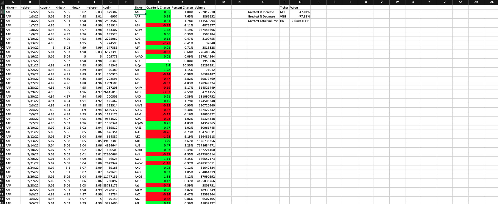
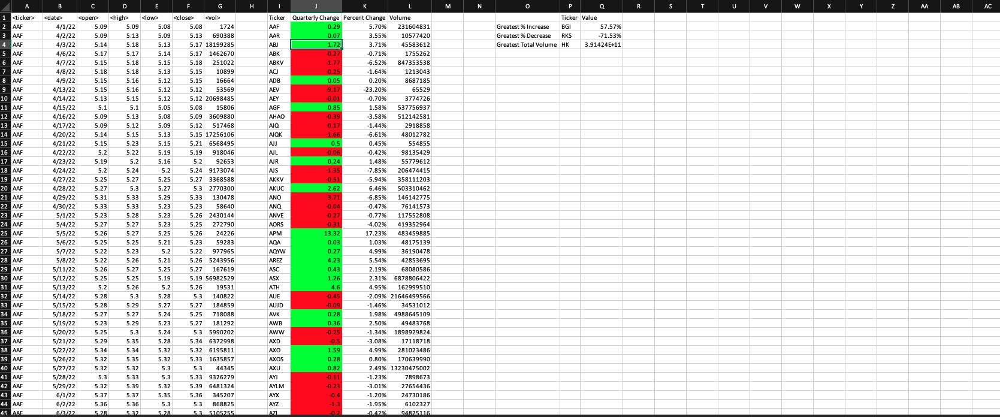
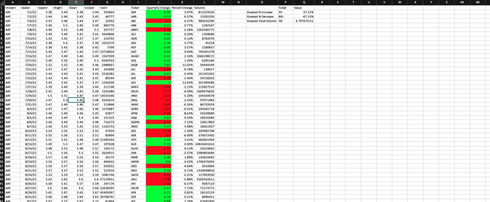
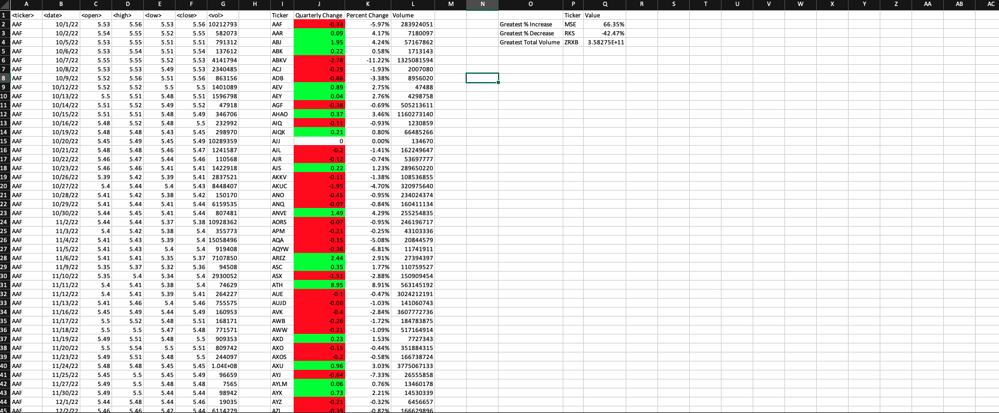

# VBA Stock Data Analysis

This project uses VBA (Visual Basic for Applications) within Excel to analyze multi-year stock market data. The goal was to automate data analysis processes, summarize stock performance, and visualize trends across multiple worksheets efficiently.

## Project Overview

The VBA script automates the following tasks:
- Loops through multiple worksheets containing stock data.
- Calculates yearly stock performance metrics:
  - Total Stock Volume
  - Yearly Change in Stock Price
  - Percent Change in Stock Price
- Applies conditional formatting for positive/negative changes.
- Outputs a summary table of key metrics for each stock ticker.

## Tools & Technologies Used
- VBA (Visual Basic for Applications)
- Excel (.xlsm)
- Excel Conditional Formatting
- Excel Formulas & Functions


## File Structure
```
Resources/
├── Multiple_year_stock_data.xlsm - Main Excel workbook with VBA code
├── alphabetical_testing.xlsx - Data file for testing

Screenshots/
├── Multiple_Year_Stock_Data_Q1.png
├── Multiple_Year_Stock_Data_Q2.png
├── Multiple_Year_Stock_Data_Q3.png
├── Multiple_Year_Stock_Data_Q4.png

VBA Script/
├── Multiple_Year_Stock_Data_Script.bas - VBA code script
```

## Skills Demonstrated
- Automating repetitive Excel tasks with VBA
- Writing loops and conditional logic in VBA
- Summarizing large datasets programmatically
- Applying conditional formatting dynamically
- Structuring clean and modular code

## Sample Output

Visualizations of the summary output per quarter:






## Key Takeaways
- Automating stock analysis saves time and reduces errors compared to manual calculations.
- VBA is powerful for data manipulation and reporting within Excel.
- Visualizing stock performance across multiple years provides clearer insights for decision making.

---


